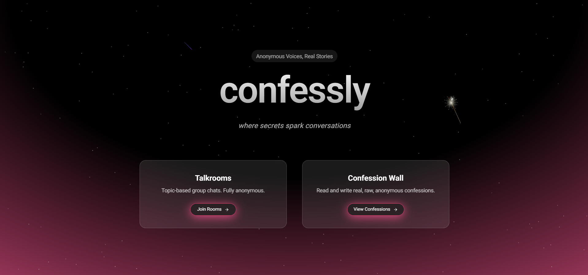
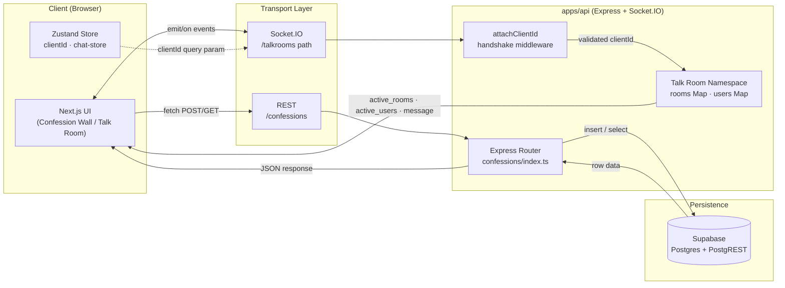

# Confessly — Real-Time Anonymous Social Platform

**An anonymous confession wall paired with live WebSocket chat rooms — no accounts, no sign-up, just a browser-generated identity.**

[🚀 Live Demo](https://confessly-web.vercel.app/)




---

## 1. What This Solves

Anonymous apps have to handle two things carefully: knowing who someone is *without* making them sign up, and keeping chat rooms working smoothly as people join and leave. Confessly handles both with a single Express + Socket.IO backend:

- **No accounts, but still "you"** — each browser gets a `clientId` generated once and saved in `localStorage`. That ID gets checked at the Socket.IO handshake (`attachClientId` middleware), so a connection is rejected before it can even join a room if the ID is missing. No sign-up, no passwords, nothing to leak.
- **Room state kept in memory** — who's online, which rooms exist, and each person's "feeling" status all live in plain `Map`/`Set` structures on the server. Nothing hits the database on every join, message, or typing event, so presence updates stay fast.
- **The confession wall talks straight to the database** — no caching tricks on the client, every read/write goes through Supabase. Slightly slower, but the feed is never showing stale or incorrect data.

### At a Glance

- Presence updates (`active_rooms`, `active_users`) are served from memory, so they're fast — no database round trip in the hot path.
- Every socket connection is checked for a `clientId` before it's allowed to join anything.
- Turborepo caches builds per workspace, so touching the frontend doesn't force the backend to rebuild (and vice versa).
- Confession reads/writes go through Supabase's REST layer, with real error messages returned instead of silent failures.

---

## 2. Tech Stack & How Data Moves

| Domain | Technology | Role |
|---|---|---|
| **Frontend & State** | Next.js 16 (App Router), React 19, TypeScript | SSR/CSR hybrid rendering, route-level code splitting |
| | Zustand (`persist` middleware) | Client identity (`clientId`), chat session state (`username`, `room`, `feeling`) persisted to `localStorage` |
| | Tailwind CSS 4, Radix UI, `class-variance-authority` | Design-system primitives (dialog, avatar, dropdown, popover) with accessible headless components |
| | React Hook Form + Zod | Schema-validated form state (e.g. 6-digit room ID regex validation) with zero re-render cost |
| | Socket.IO Client | Bidirectional transport for talk rooms |
| **Backend Services** | Node.js, Express 5 | REST API surface (`/confessions`, `/ping` liveness probe) |
| | Socket.IO Server (`socket.io`) | Talk rooms namespace — presence, typing, and feeling-state broadcast |
| | Custom Socket.IO middleware | `attachClientId` — handshake-level identity enforcement before any room join |
| | `ws` | Low-level WebSocket primitive available for non-Socket.IO transports |
| **Data & Infra** | Supabase (Postgres + PostgREST) | Confession persistence, ordered by `created_at`, accessed via `@supabase/supabase-js` |
| | Turborepo + npm Workspaces | Monorepo task orchestration (`build`, `lint`, `dev --parallel`, `check-types`) with remote/local caching |
| | Vercel | Frontend hosting (`apps/web`) |
| | Render | Backend hosting (`apps/api`), CORS-pinned to the deployed web origin |

### How a Request Flows Through the System



---

## 3. Getting It Running

### What You Need

| Requirement | Version / Notes |
|---|---|
| Node.js | ≥ 18 (enforced via root `package.json#engines`) |
| npm | 11.x (`packageManager` pinned in root `package.json`) |
| Supabase project | Postgres instance with a `confessions` table (`title`, `content`, `confession_type`, `username`, `created_at`) |
| Ports | `3000` (web), `3001` (api, configurable via `PORT`) |

### Install & Run

```bash
# 1. Clone and install all workspace dependencies (npm workspaces)
git clone <repo-url> confessly
cd confessly
npm install

# 2. Configure environment variables (see .env.example blocks below)
cp apps/api/.env.example apps/api/.env
cp apps/web/.env.local.example apps/web/.env.local

# 3. Run all apps in parallel via Turborepo (dev mode, hot reload)
npm run dev

# 4. Production build (Turborepo dependency-aware build graph)
npm run build

# 5. Run the API in production
cd apps/api && npm run build && npm start

# 6. Run the web app in production
cd apps/web && npm run build && npm start
```

### `apps/api/.env.example`

```bash
# Server
PORT=3001

# Supabase (service-layer access to Postgres)
NEXT_PUBLIC_SUPABASE_URL=https://<project-ref>.supabase.co
NEXT_PUBLIC_SUPABASE_ANON_KEY=<supabase-anon-key>
```

### `apps/web/.env.local.example`

```bash
# Backend origin consumed by REST fetches and Socket.IO client
NEXT_PUBLIC_API_URL=http://localhost:3001

# Canonical deployed URL (used for metadata / absolute links)
NEXT_PUBLIC_URL=http://localhost:3000

# Third-party GIF picker integration (confession composer)
NEXT_PUBLIC_TENOR_API_KEY=<tenor-api-key>
```

---

## 4. API & Socket Reference

### REST — `apps/api/src/routes/confessions`

#### `POST /confessions`
Creates a new confession. If no username is given, it's stored as `"Anonymous"` — there's no login, so nothing stops anyone from posting as whoever they want.

**Request**
```json
{
  "title": "3am thoughts",
  "content": "I still check their profile every night.",
  "confession_type": "regret",
  "username": ""
}
```

**Response — `201 Created`**
```json
{
  "message": "Confession submitted successfully",
  "data": {
    "id": 482,
    "title": "3am thoughts",
    "content": "I still check their profile every night.",
    "confession_type": "regret",
    "username": "Anonymous",
    "created_at": "2026-07-18T02:14:33.120Z"
  }
}
```

#### `GET /confessions`
Returns every confession, newest first, for the wall.

**Response — `200 OK`**
```json
[
  {
    "id": 482,
    "title": "3am thoughts",
    "content": "I still check their profile every night.",
    "confession_type": "regret",
    "username": "Anonymous",
    "created_at": "2026-07-18T02:14:33.120Z"
  }
]
```

#### `GET /ping`
A simple health check — used to keep the Render instance warm and confirm it's alive.

**Response — `200 OK`**
```text
awake
```

---

### WebSocket — Talk Rooms (`path: /talkrooms`)

Group chat rooms with live presence, typing indicators, and a per-user "feeling" status. Every connection must include a `clientId` in the handshake, or it's rejected.

| Event (client→server) | Payload | Event (server→client) | Payload |
|---|---|---|---|
| `join_room` | `{ username, room, feeling? }` | `active_rooms` | `string[]` (room IDs) |
| `message` | `{ user, text, room, feeling? }` | `active_users` | `Array<{ username, room, feeling }>` |
| `typing` | `{ username, room }` | `message` | `{ user, text, room, timestamp }` |
| `change_user_feeling` | `{ username, room, feeling }` | `system_message` | `{ text, timestamp, isSystem: true }` |

**Sample: `join_room` → `system_message` broadcast**
```json
// client emits
{ "username": "quiet_owl", "room": "482913", "feeling": "neutral" }

// server broadcasts to room
{
  "text": "quiet_owl joined the room",
  "timestamp": "2026-07-18T02:15:01.442Z",
  "isSystem": true
}
```

---

## Project Structure

```bash
apps/
  web/              # Next.js 16 frontend (App Router)
    app/confessions/ # Post + wall (masonry feed) routes
    app/talkrooms/   # Room selector, chat UI, socket lifecycle
    lib/             # Zustand stores (clientId, chat state)
  api/              # Express + Socket.IO backend
    src/routes/       # REST: /confessions
    src/socket/       # Talk room namespace
    src/middleware/    # Handshake-level clientId enforcement
    src/lib/           # Supabase client

packages/
  ui/                 # Shared UI primitives
  eslint-config/      # Shared lint rules across workspaces
  typescript-config/  # Shared tsconfig bases
```

---

## Status

Confession Wall and Talk Rooms are complete and stable. More features are planned and will be added in future versions.
